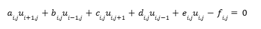

# Proyecto Semestral: Modelamiento de Emisión de Contaminantes en Ríos

### Información del Curso
* **Universidad:** Pontificia Universidad Católica de Chile
* **Departamento:** Departamento de Ingeniería Química y Bioprocesos
* **Curso:** IIQ2003- Fenómenos de Transporte 
* **Profesor:** Felipe Huerta Pérez
* **Semestre:** Segundo Semestre del 2025

---

### Detalles de la Entrega
* **Integrantes:** Benjamín Mondaca, Clemente de Geyter y Rona Tempel.
* **Ayudante:** Carlos Soto 
* **Profesor:** Felipe Huerta 
* **Fecha:** 9 de diciembre de 2025 

---

## Descripción general
Este proyecto aborda el modelamiento de la dispersión de contaminantes en cursos de agua (ríos o canales), enfocándose en la contaminación de estos, un problema crítico y de alta relevancia en Chile. La crisis hídrica en el país depende de muchos factores, siendo el desecho de productos químicos (como farmacéuticos o agroindustriales) uno de los factores más relevantes, donde un 14% de los problemas hídricos provienen de desechos químcos en la agroindustria (Universidad de Chile, 2022). 

Asimismo, la contaminación de cursos de agua representa uno de los problemas más relevantes en la actualidad, de manera que se tienen distintos Objetivos de Desarrollo Sustentable (ODS) relacionados a la contaminación de cursos de agua: ODS 6 (Agua limpia y saneamiento), ODS 12 (Producción y consumo responsables), ODS 14 (Vida submarina) y ODS 15 (Vida de ecosistemas terrestres) (Naciones Unidas, s.f.).

De esta manera, el objetivo de este proyecto es realizar un modelo relacionado a los fenómenos de transporte que rigen el curso del agua. En este caso, se consideró un modelo 2-D en estado estacionario, lo que permitirá simular la forma en que los contaminantes vertidos se distribuyen longitudinal y transversalmente a lo largo del río, con el principal objetivo de tener una idea sobre parámetros óptimos a la cual los distintos actores descargan sus desechos. 

## Sistema modelado
El transporte y dispersión de los contaminantes se rige principalmente por los siguientes fenómenos:
* **Advección:** Corresponde al fenómeno en donde los contaminantes son empujados por la velocidad de la corriente del río en la dirección longitudinal ($x$). Este fenómeno es el dominante en este eje.
* **Difusión turbulenta:** Se refiere a la dispersión del contaminante en la dirección transversal ($y$) debido a la turbulencia del flujo.
* **Reacción química:** Corresponde, en este caso, a la desintegración de los contaminantes (p. ej., biodegradación) en una velocidad de reacción de primero orden.

A su vez, para la simplificación del problema y un modelamiento correcto, los supuestos supuestos clave son:
* **Estado estacionario ($\frac{dC}{dt}$ = 0):** Concentración del contaminante y el caudal del río son constantes con el tiempo
* **Concentración constante en $z$:** Se asume que el río es poco profundo, permitiendo que se alcance una distribución uniforme del contaminante en la dirección vertical ($z$).
* **Difusión despreciable en $x$:** Transporte por advección es mucho mayor que el transporte por difusión en la dirección longitudinal, debido a la alta velocidad del flujo.
* **Difusividad transversal $y$ velocidades constantes:** $\epsilon_{y}$, $u(x,y)$, y $v(x,y)$ se asumen constantes ($\epsilon_{0}$, $u_{x}$, $v_{y}$) para simplificar la resolución numérica.

Donde el diagrama representativo del río (visto desde arriba) es el siguiente:

En base a lo mencionado con anterioridad, es posible definir la ecuación diferencial parcial (EDP) que define el problema de la siguiente manera:

con $C(x,y)$ la concentración del contaminante, $u$ y $\nu$ las velocidades longitudinal y transversal, $\epsilon_{y}$ el coeficiente de difusión turbulenta lateral y $k_{e}$ constante de la reacción de primer orden. Las condiciones de borde de este problema corresponden a 
* **C.B. Neumann:** Se plantean dos condiciones de borde debido a la no difusividad de contaminantes hacia las paredes del río, es decir, no hay flujo de contaminante en $y = 0$ e $y = W$. Esto anterior corresponde a: $$\frac{dC}{dy} (x, y=0) = 0$$; $$\quad \frac{dC}{dy} (x, y=W) = 0$$
* **C.B. Dirichlet:** En este caso se plantean dos condiciones en el inicio del río, donde el agua trae de por si una concentración de contaminantes constante conocida $C_b$ y el eliminador de residuos/contaminantes también trae una concentración conocida $C_0$. De esta manera, y considerando que el ancho del difusor es de $W-a$, se tiene que: $$C(0,0\le y\le a)=C_{b}$$; $$\quad C(0, a<y\le W)=C_{0}$$

## Método numérico
Para resolver la EDP lineal de segundo orden del sistema, se ha seleccionado el método de Diferencias Finitas en conjunto con el método de solución iterativa de Sobre-Relajación Sucesiva (SOR). 

### Discretización EDP
El método de Diferencias Finitas es adecuado para discretizar porque permite transformar la EDP en un sistema de ecuaciones lineales al discretizar el dominio (el río) en una malla (o meshgrid) de nodos $(N_i, N_j)$. Este método de discretización es ideal para dominios con geometrías simples y rectangulares, como ocurre en este caso.
* **Derivada Longitudinal ($$\frac{\partial C}{\partial x}$$):** Derivada Longitudinal (x): Se ha aplicado una diferencia finita hacia atrás, debido a que el movimiento del río (agua) ocurre desde $x$ hacia $x+\Delta x$, por lo que para obtener la concentración en $i$ se debe observar $i-1$: $$\frac{\partial C}{\partial x} \approx \frac{C_{i,j}-C_{i-1,j}}{\Delta x} $$
* **Primera y Segunda Derivada Transversal:** Se usa una diferencia finita central debido a que en el eje $y$ el fenómeno de difusión (transporte hacia ambos lados), es decir, para obtener la concentración en $j$ deben observarse los vecinos: $$\frac{\partial C}{\partial y} \approx \frac{C_{i,j+1}-C_{i,j-1}}{2\Delta y}$$; $$\quad \frac{\partial^2 C}{\partial y^2} \approx \frac{C_{i,j+1}-2C_{i,j}+C_{i,j-1}}{\Delta y^{2}}$$

 Al sustituir estas aproximaciones en la EDP original y agrupando términos, se obtiene una ecuación tal que:

 
### Método SOR
El método de solución iterativa de Sobre-Relajación Sucesiva es un algoritmo iterativo ideal para sistemas lineales de la forma $A\mathbf{x} = \mathbf{b}$, como ocurre en el problema presentado. Para esto, se necesita que los coeficientes de velocidad ($u, v$) y difusividad ($\epsilon_y$) no dependan de la concentración $C$, donde al ser constantes se cumple con esta condición. Al discretizar como se mostró con anterioridad, se obtiene un sistema de ecuaciones lineales donde el método SOR puede actuar permitiendo obtener una solución de manera muy rápida y precisa. 

Para poder utilizar este método, se busca tener una ecuación de la forma 

donde en este caso, al discretizar se obtuvo que

### Condiciones de Borde Discretizadas

**1. C.B. Neumann:** Para la condición de borde definida como $$\frac{dC}{dy} (x, y=0) = 0$$, mediante la discretización centrada se tiene que la nueva condición de borde en su forma discretizada es $$C_{i,1} = C_{i,-1} \quad \forall i \in {[0, N_x]}$$.

**2. C.B. Neumann:** De manera análoga que para la primera condición de borde, sea $$\frac{dC}{dy} (x, y=W) = 0$$, se tiene que la nueva condición de borde discretizada es $$C_{i,N_y+1} = C_{i,N_y-1} \quad \forall i \in {[0, N_x]}$$.

**3. C.B. Dirichlet:**  En este caso, se define la condición $$C(0, a<y\le W)=C_{0}$$ en su forma discretizada como $$C_{0,j} = C_0 \quad \forall j \in {[j_a, N_y]}$$ donde $$j_a = \frac{a}{\Delta y}$$.

**4. C.B. Dirichlet:** De manera similar que en la condición 3, se define $$C(0, 0<y\le a)=C_{b}$$ en su forma discretizada como $$C_{0,j} = C_b \quad \forall j \in {[0, j_a]}$$ donde $$j_a = \frac{a}{\Delta y}$$.

## Instrucciones ejecución código 

### Requisitos
Se ha utilizado el lenguaje de programación Python, específicamente la versión Python 3. Las librerías necesarias para la ejecución del código corresponden a

* **NumPy:** Utilizada para el manejo matricial y operaciones numéricas.
* **MatPlotLib:** Utilizada para la visualización y generación de gráficos.

Si no cuenta con estas librerías instaladas, debe utilizar el comando ***pip install numpy matplotlib*** en la terminal.

### Ejecución

En primer lugar, se debe crear una copia exacta de este repositorio en su computador. Para esto existen varias opciones, donde la más rápida corresponde a la descarga del archivo ***.zip***. Para esto, se debe hacer click en el botón verde **Code** en la parte superior de la página y seleccionar la opción **Download ZIP**. Posteriormente, se debe descomprimir el archivo descargado, y abrir la nueva carpeta descomprimida en el editor de código utilizado (p. ej. VS Code). De esta manera, al seleccionar el archivo dentro de la carpeta **Código principal** con la extensión ***.ipynb***, se puede ejecutar el código.

### Parámetros

Para modificar las condiciones físicas del río, se deben modificar solo los valores definidos al inicio del código.
* **Velocidades:** Para modificar la velocidad transversal ($x$) del río, se debe modificar la variable definida **u**. Por otra parte, la velocidad longitudinal corresponde a la variable **v**. Esta debe ser en un principio negativa, debido a que valores positivos implicarían que el contaminante no se distribuya en el río.
* **Difusividad:** Corresponde a la variable **e_y**, donde valores más cercanos a cero implica una menor turbulencia y valores mayores a 1 una turbulencia más significativa.
* **Concentraciones iniciales del contaminante:** Si se desea modificar la concentración proveniente del tubo con contaminantes, se debe alterar la variable **c_0**. por otra parte, si se desea cambiar la concentración de contaminantes que trae el río, se debe cambiar el valor de **c_b**.
* **Ancho del tubo con contaminantes:** Se debe alterar la variable **a1**, que indica el ancho del río.
* **Longitud y ancho del río:** El ancho del río se puede modificar al cambiar el valor de **W**, mientras el largo está definido por la variable **L**.

Al alterar estos valores, el código proporcionará nuevos gráficos en base a la solución encontrada por el método SOR. **Se debe tener precaución, ya que alterar mucho los valores puede implicar que el valor óptimo de $$\omega$$ cambie, por lo que la solución podría tardar más tiempo en encontrarse.**

## Resultados
Los principales se encuentran en la carpeta Los gráficos y tablas se encuentran en la carpeta [Resultados](./Resultados). Estos gráficos y tablas resumen las implicancias físicas del modelo de dispersión.

### Efecto de los términos convectivos (Velocidad)
Los resultados evidencian una fuerte dependencia del perfil de concentración respecto a la velocidad del río ($u$).

* **Baja Velocidad:** Como se observa en la primera figura, el contaminante alcanza un rango de concentraciones mucho menor y tiende a estancarse o difundirse lentamente.
* **Alta Velocidad:** En contraste, la segunda figura muestra cómo velocidades altas arrastran el contaminante, modificando drásticamente el perfil aguas abajo.

### Cambios Difusión v/s Convección
Se analizó el comportamiento cuando domina uno de los dos fenómenos de transporte:

* **Dominio de la Difusión:** El perfil de concentración es mucho más "oscuro" (intenso), indicando que el contaminante se dispersa lateralmente con mayor fuerza antes de ser arrastrado.
* **Dominio de la Convección:** El gráfico presenta un gradiente de colores más claros y amarillos, reflejando que la velocidad inherente del río diluye y transporta la pluma de contaminación rápidamente río abajo antes de que pueda difundirse transversalmente.

### Limitaciones del Modelo
El modelo actual asume un comportamiento 2D y desprecia la profundidad del río. Esto ignora los efectos de mezcla en el eje vertical (axial), lo cual es una simplificación importante. Una mejora futura sería incluir una función empírica que corrija la concentración considerando la profundidad del cauce.

## Conclusiones

El presente estudio evidencia el alto potencial de los ríos en el transporte de contaminantes hacia ecosistemas marinos, demostrando una correlación directa entre las altas velocidades del caudal y la dispersión de residuos industriales. Esta simulación aborda una problemática crítica para Chile, contextualizada en la crisis hídrica y el sobreotorgamiento de derechos de aprovechamiento de aguas, lo que ofrece una herramienta para la toma de decisiones en políticas públicas. El modelo permite evaluar zonas de descarga que presentarían un alto riesgo ecológico, promoviendo una gestión más sustentable de los recursos hídricos. Si bien la aproximación 2-D actual presenta la limitación de ignorar los efectos de mezcla asociados a la profundidad del río, los resultados obtenidos son suficientes para alertar sobre la peligrosidad de la eliminación de desechos en cursos de agua de alta velocidad, destacando la necesidad de establecer regulaciones espaciales más estrictas para la protección ambiental.

## Referencias bibliográficas 
1. Chile: el país más afectado por la crisis hídrica en América Latina - Universidad de Chile. (s. f.). Universidad de Chile. Recuperado el 2 de noviembre de 2025, de https://uchile.cl/noticias/184820/chile-el-pais-mas-afectado-por-la-crisis-hidrica-en-america-latina
2. Naciones Unidas. (s.f.). Objetivos de Desarrollo Sostenible. Recuperado el 2 de noviembre de 2025, de https://www.un.org/sustainabledevelopment/es/
3. Primer Computational Mathematics. (s.f.). Solving PDEs – SOR. Recuperado el 30 de noviembre de 2025, de https://primer-computational-mathematics.github.io/book/c_mathematics/numerical_methods/6_Solving_PDEs_SOR.html
4. two-dimensional model for contaminant dispersion in rivers and channels with spatially variable coefficients. Environmental Modelling & Software, 21(5), 699-709. https://doi.org/10.1016/j.envsoft.2005.02.002

