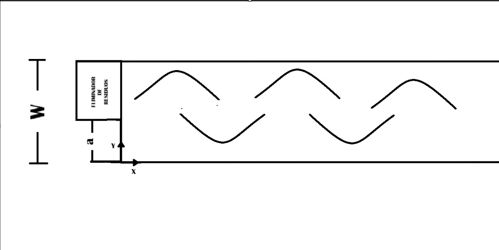
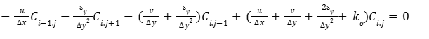
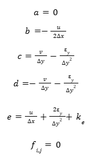

# Proyecto Semestral: Modelamiento de Emisión de Contaminantes en Ríos

### Información del Curso
* **Universidad:** Pontificia Universidad Católica de Chile
* **Departamento:** Departamento de Ingeniería Química y Bioprocesos
* **Curso:** IIQ2003- Fenómenos de Transporte 
* **Profesor:** Felipe Huerta Pérez
* **Semestre:** Segundo Semestre del 2025

---

### Detalles de la Entrega
* **Integrantes:** Benjamín Mondaca, Clemente de Geyter y Rona Tempel.
* **Ayudante:** Carlos Soto 
* **Profesor:** Felipe Huerta 
* **Fecha:** 9 de diciembre de 2025 

---

## Descripción general
Este proyecto aborda el modelamiento de la dispersión de contaminantes en cursos de agua (ríos o canales), enfocándose en la contaminación de estos, un problema crítico y de alta relevancia en Chile. La crisis hídrica en el país depende de muchos factores, siendo el desecho de productos químicos (como farmacéuticos o agroindustriales) uno de los factores más relevantes, donde un 14% de los problemas hídricos provienen de desechos químcos en la agroindustria (Universidad de Chile, 2022). 

Asimismo, la contaminación de cursos de agua representa uno de los problemas más relevantes en la actualidad, de manera que se tienen distintos Objetivos de Desarrollo Sustentable (ODS) relacionados a la contaminación de cursos de agua: ODS 6 (Agua limpia y saneamiento), ODS 12 (Producción y consumo responsables), ODS 14 (Vida submarina) y ODS 15 (Vida de ecosistemas terrestres) (Naciones Unidas, s.f.).

De esta manera, el objetivo de este proyecto es realizar un modelo relacionado a los fenómenos de transporte que rigen el curso del agua. En este caso, se consideró un modelo 2-D en estado estacionario, lo que permitirá simular la forma en que los contaminantes vertidos se distribuyen longitudinal y transversalmente a lo largo del río, con el principal objetivo de tener una idea sobre parámetros óptimos a la cual los distintos actores descargan sus desechos. 

## Sistema modelado
El transporte y dispersión de los contaminantes se rige principalmente por los siguientes fenómenos:
* **Advección:** Corresponde al fenómeno en donde los contaminantes son empujados por la velocidad de la corriente del río en la dirección longitudinal ($x$). Este fenómeno es el dominante en este eje.
* **Difusión turbulenta:** Se refiere a la dispersión del contaminante en la dirección transversal ($y$) debido a la turbulencia del flujo.
* **Reacción química:** Corresponde, en este caso, a la desintegración de los contaminantes (p. ej., biodegradación) en una velocidad de reacción de primero orden.

A su vez, para la simplificación del problema y un modelamiento correcto, los supuestos supuestos clave son:
* **Estado estacionario ($\frac{dC}{dt}$ = 0):** Concentración del contaminante y el caudal del río son constantes con el tiempo
* **Concentración constante en $z$:** Se asume que el río es poco profundo, permitiendo que se alcance una distribución uniforme del contaminante en la dirección vertical ($z$).
* **Difusión despreciable en $x$:** Transporte por advección es mucho mayor que el transporte por difusión en la dirección longitudinal, debido a la alta velocidad del flujo.
* **Difusividad transversal $y$ velocidades constantes:** $\epsilon_{y}$, $u(x,y)$, y $v(x,y)$ se asumen constantes ($\epsilon_{0}$, $u_{x}$, $v_{y}$) para simplificar la resolución numérica.

Donde el diagrama representativo del río (visto desde arriba) es el siguiente:

En base a lo mencionado con anterioridad, es posible definir la ecuación diferencial parcial (EDP) que define el problema de la siguiente manera:

con $C(x,y)$ la concentración del contaminante, $u$ y $\nu$ las velocidades longitudinal y transversal, $\epsilon_{y}$ el coeficiente de difusión turbulenta lateral y $k_{e}$ constante de la reacción de primer orden. Las condiciones de borde de este problema corresponden a 
* **C.B. Neumann:** Se plantean dos condiciones de borde debido a la no difusividad de contaminantes hacia las paredes del río, es decir, no hay flujo de contaminante en $y = 0$ e $y = W$. Esto anterior corresponde a $$\frac{dC}{dy} (x, y=0) = 0$$ y $$\frac{dC}{dy} (x, y=W) = 0$$
* **C.B. Dirichlet:** En este caso se plantean dos condiciones en el inicio del río, donde el agua trae de por si una concentración de contaminantes constante conocida $C_b$ y el eliminador de residuos/contaminantes también trae una concentración conocida $C_0$. De esta manera, y considerando que el ancho del difusor es de $W-a$, se tiene que $$C(0,0\le y\le a)=C_{b}$$ y $$C(0, a<y\le W)=C_{0}$$

## Método numérico
Para resolver la EDP lineal de segundo orden del sistema, se ha seleccionado el método de Diferencias Finitas en conjunto con el método de solución iterativa de Sobre-Relajación Sucesiva (SOR). 

### Discretización EDP
El método de Diferencias Finitas es adecuado para discretizar porque permite transformar la EDP en un sistema de ecuaciones lineales al discretizar el dominio (el río) en una malla (o meshgrid) de nodos $(N_i, N_j)$. Este método de discretización es ideal para dominios con geometrías simples y rectangulares, como ocurre en este caso.
* **Derivada Longitudinal ($$\frac{\partial C}{\partial x}$$):** Derivada Longitudinal (x): Se ha aplicado una diferencia finita hacia atrás, debido a que el movimiento del río (agua) ocurre desde $x$ hacia $x+\Delta x$, por lo que para obtener la concentración en $i$ se debe observar $i-1$: $$\frac{\partial C}{\partial x} \approx \frac{C_{i,j}-C_{i-1,j}}{\Delta x} $$
* **Primera y Segunda Derivada Transversal:** Se usa una diferencia finita central debido a que en el eje $y$ el fenómeno de difusión (transporte hacia ambos lados), es decir, para obtener la concentración en $j$ deben observarse los vecinos: $$\frac{\partial C}{\partial y} \approx \frac{C_{i,j+1}-C_{i,j-1}}{2\Delta y}$$; $$\frac{\partial^2 C}{\partial y^2} \approx \frac{C_{i,j+1}-2C_{i,j}+C_{i,j-1}}{\Delta y^{2}}$$

 Al sustituir estas aproximaciones en la EDP original y agrupando términos, se obtiene una ecuación tal que:

 
### Método SOR
El método de solución iterativa de Sobre-Relajación Sucesiva es un algoritmo iterativo ideal para sistemas lineales de la forma $A\mathbf{x} = \mathbf{b}$, como ocurre en el problema presentado. Para esto, se necesita que los coeficientes de velocidad ($u, v$) y difusividad ($\epsilon_y$) no dependan de la concentración $C$, donde al ser constantes se cumple con esta condición. Al discretizar como se mostró con anterioridad, se obtiene un sistema de ecuaciones lineales donde el método SOR puede actuar permitiendo obtener una solución de manera muy rápida y precisa. 

Para poder utilizar este método, se busca tener una ecuación de la forma 

donde en este caso, al discretizar se obtuvo que 

### Condiciones de Borde

## Instrucciones ejecución código 

## Resultados
Los principales se encuentran en la carpeta Los gráficos y tablas se encuentran en la carpeta [Resultados](./Resultados). Estos gráficos y tablas resumen las implicancias físicas del modelo de dispersión.

## Referencias bibliográficas 
1. Chile: el país más afectado por la crisis hídrica en América Latina - Universidad de Chile. (s. f.). Universidad de Chile. Recuperado el 2 de noviembre de 2025, de https://uchile.cl/noticias/184820/chile-el-pais-mas-afectado-por-la-crisis-hidrica-en-america-latina
2. Naciones Unidas. (s.f.). Objetivos de Desarrollo Sostenible. Recuperado el 2 de noviembre de 2025, de https://www.un.org/sustainabledevelopment/es/
3. Primer Computational Mathematics. (s.f.). Solving PDEs – SOR. Recuperado el 30 de noviembre de 2025, de https://primer-computational-mathematics.github.io/book/c_mathematics/numerical_methods/6_Solving_PDEs_SOR.html
4. two-dimensional model for contaminant dispersion in rivers and channels with spatially variable coefficients. Environmental Modelling & Software, 21(5), 699-709. https://doi.org/10.1016/j.envsoft.2005.02.002

